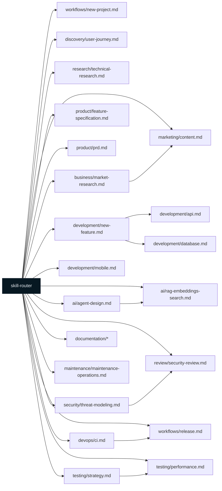

# Detailed Agents → Skills Graph

This diagram expands the high-level mapping into a node-per-skill view for core routes in `.skills/core/skill-router.md`.

If you want, I can auto-generate a complete graph that enumerates every file under `.skills/` and `.ai/tasks/` and draws ownership arrows — say `yes` and I'll parse the repo and produce a full SVG export.
