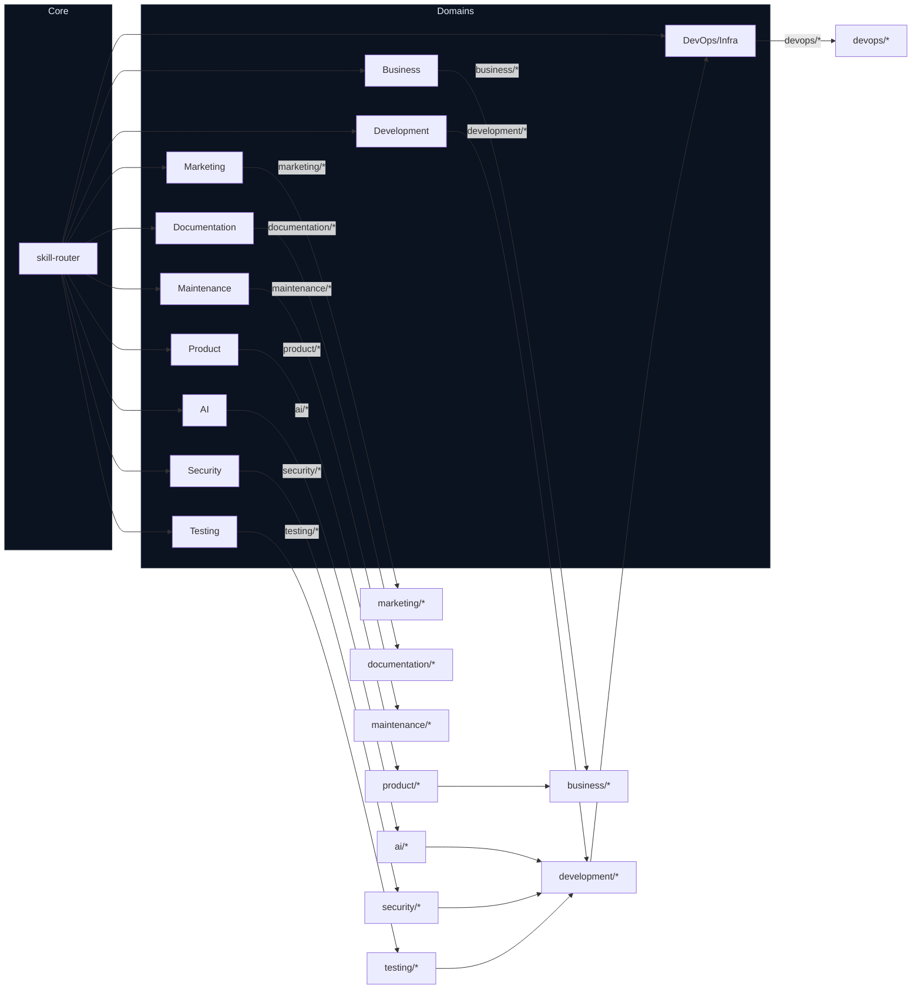

# Agents & Skills Graph

The diagram below visualizes major intent domains routed by `.skills/core/skill-router.md` and their primary skill folders. Use this as a high-level map of which skill to invoke for each intent.

Notes:

- Open this file in VS Code and preview the Mermaid block, or use a Mermaid renderer to export to PNG/SVG.
- If you want a node-per-skill or a directed graph of specific files, tell me and I'll expand the diagram programmatically.
