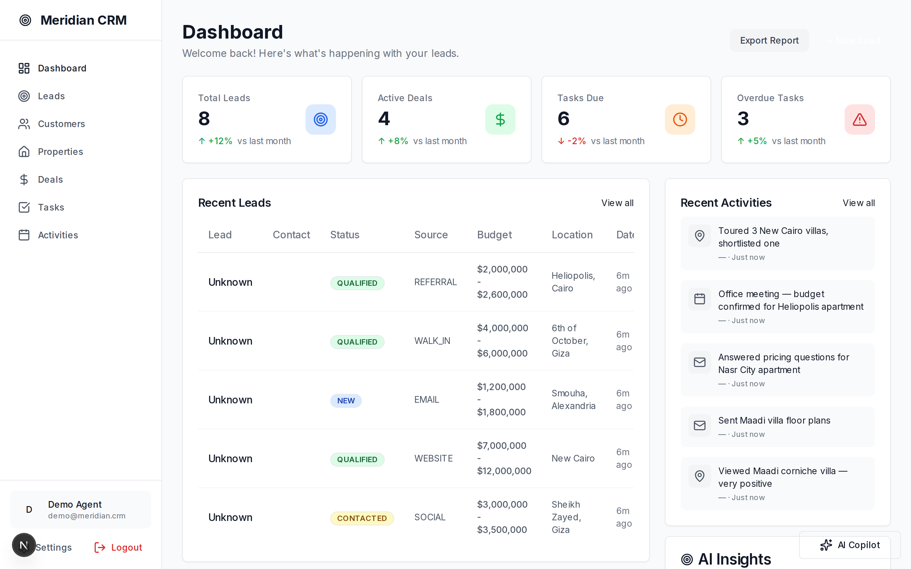
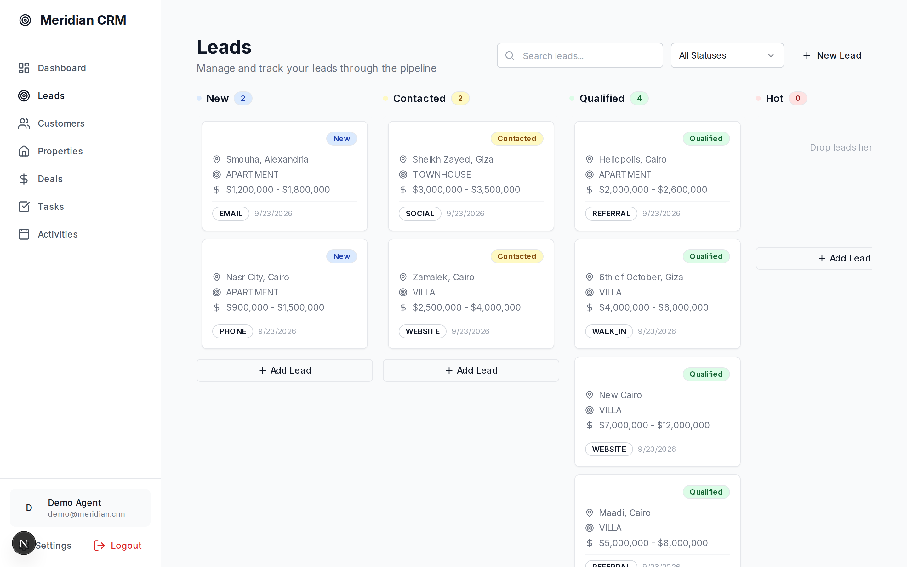
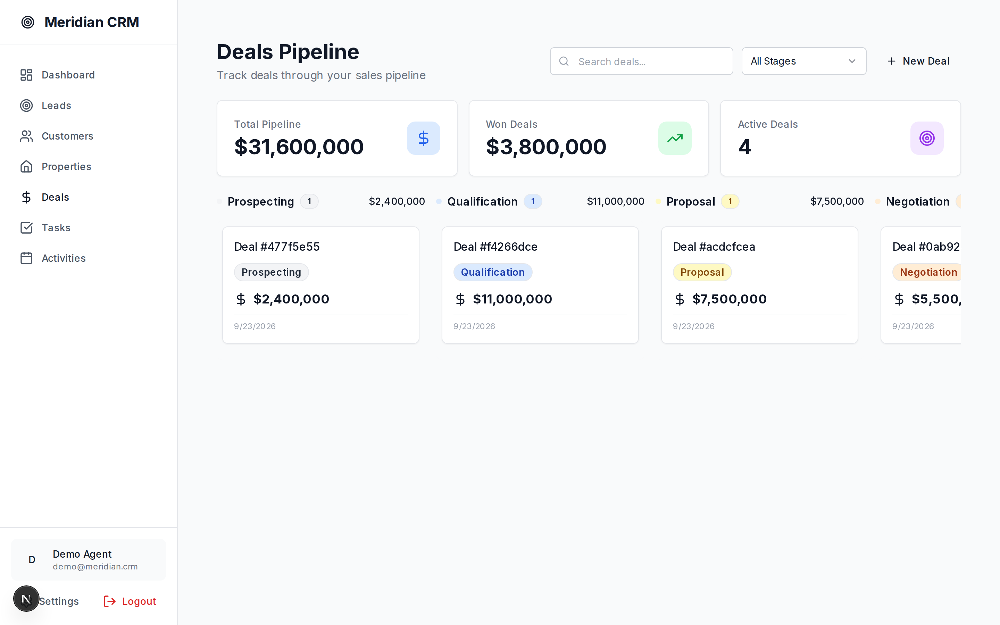
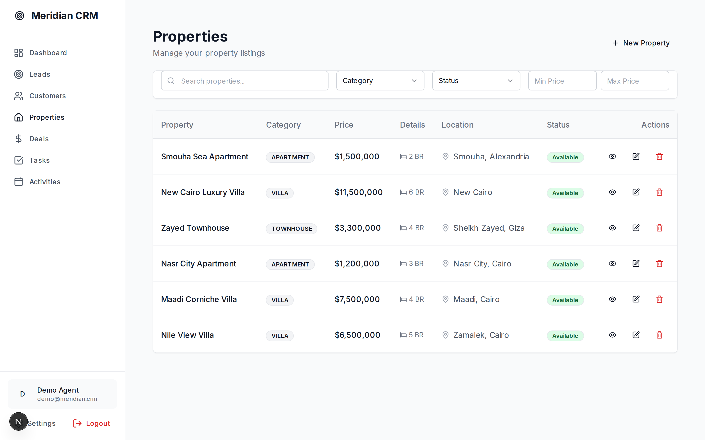
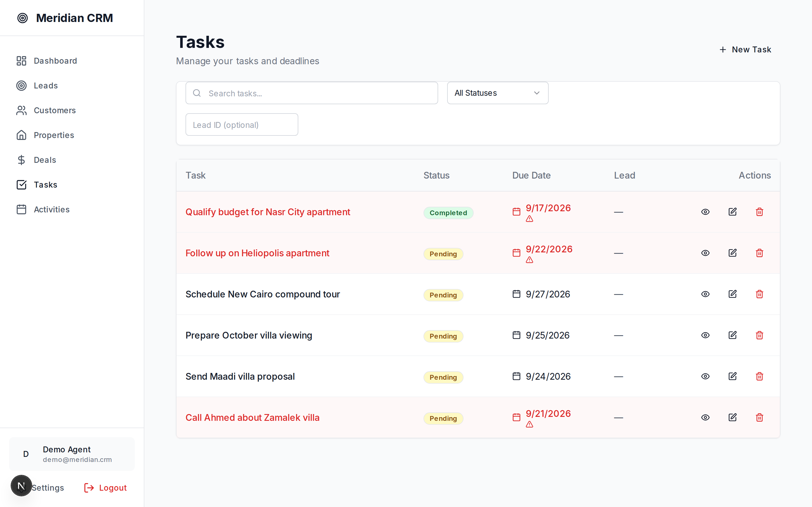
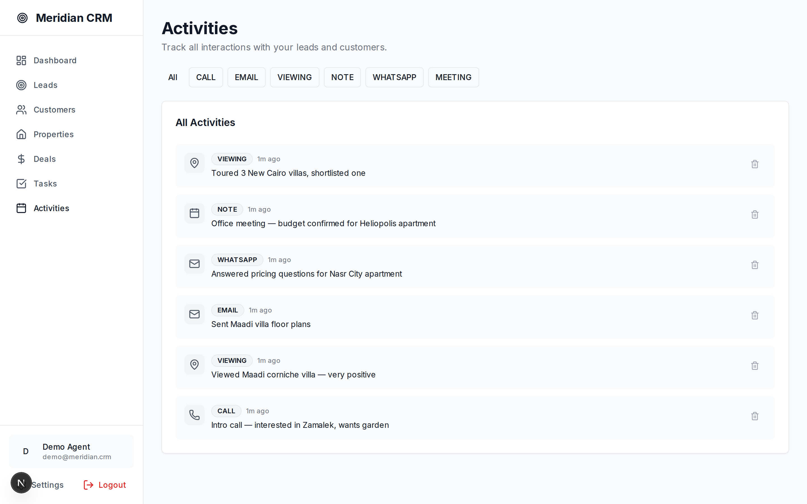

# Meridian CRM

[](https://github.com/s-a-m-y1/meridian-crm/actions/workflows/ci-cd.yml)

**🌐 Live demo:** https://meridian-crm-xi.vercel.app (Demo login: `demo@meridian.crm` / `Demo1234!x`)

Production-grade **Real Estate CRM** with an AI intelligence layer — NestJS + TypeORM + PostgreSQL backend, Next.js 15 + React 19 frontend.

> **Note:** the live demo is fully functional **24/7** (sign-in included): the
> frontend and backend both run on Vercel (backend serverless:
> https://meridian-crm-api-two.vercel.app) with a hosted Neon PostgreSQL.
> In this permanent tier, scheduled AI jobs and WebSocket live-updates are
> disabled (mock AI responses). For the full-featured build (real AI queues +
> realtime), run the local stack and expose it via `scripts/online-demo.sh start`

## Screenshots

| Dashboard | Leads Kanban |
|-----------|--------------|
|  |  |

| Deals Pipeline | Properties |
|----------------|------------|
|  |  |

| Tasks | Activities |
|-------|------------|
|  |  |

## Quick Start

```bash
# Full stack (Postgres, Redis, LocalStack, backend, frontend)
docker-compose -f docker-compose.dev.yml up -d

# Seed realistic demo data
node scripts/seed-demo.mjs
```

- Frontend: http://localhost:3000
- Backend API: http://localhost:4000/api/v1 (docs at `/api/docs`)

**Demo login:** `demo@meridian.crm` / `Demo1234!x`

## Monorepo Layout

| Path | What |
|------|------|
| `backend/` | NestJS API — auth (JWT + refresh rotation), multi-tenant orgs, leads/customers/properties/deals/tasks/activities/notes, AI layer (briefings, scoring, forecasting), files, observability |
| `frontend/` | Next.js 15 App Router — dashboard, Kanban lead pipeline, deal pipeline, global search (⌘K), AI Copilot |
| `scripts/` | `seed-demo.mjs` (demo data), `status_report.py`, `validate_skills_refs.py` |
| `docs/screenshots/` | UI screenshots (regenerate: `node frontend/scripts/take-screenshots.mjs`) |

## Quality Gates

```bash
cd backend  && npm run typecheck && npm run test     # 24 unit tests
cd frontend && npm run typecheck && npm run test     # 24 Playwright E2E
python3 scripts/validate_skills_refs.py             # doc path validation
```

CI runs these on every push — see `.github/workflows/ci-cd.yml`.

## Deployment

- **Frontend (Vercel)** — deployed: run `vercel --prod` from `frontend/`. Production
  alias: https://meridian-crm-xi.vercel.app. `NEXT_PUBLIC_API_URL_INTERNAL` points
  the `/api/*` rewrite at the public backend URL.
- **Online demo (current setup)** — backend + Redis run locally and are exposed via
  a Cloudflare quick tunnel; PostgreSQL lives on Neon. Manage it with
  `scripts/online-demo.sh {start|stop|status|url}`. See
  [DEPLOYMENT.md](DEPLOYMENT.md#online-demo-cloudflare-tunnel--neon).
- **Backend (self-hosted prod path)** — deploy `backend/` (Dockerfile provided) to
  any Node host (Railway / Render / Fly) with a managed PostgreSQL + Redis, then set
  the env vars from `backend/.env.example`. See [DEPLOYMENT.md](DEPLOYMENT.md)
  for the full checklist.

---

# AI Software Engineering Operating System (Skills System)

A Markdown-based skills system that lets an AI coding agent operate as a **complete engineering organization** — from idea to production and maintenance.

## What This Is

- **`.skills/`** — The operating system: 70+ modular skills covering the full SDLC.
- **`.ai/`** — Project memory: state, decisions, tasks, bugs, risks, context.
- **`AGENT.md`** — The boot file an agent reads first.

The agent moves between **roles** (Product Manager → Architect → Developer → QA → Security → DevOps → SRE) by loading the skills mapped to each phase.

## Operating Model

```
User Request
   ↓
 .skills/core/skill-router.md        (decide which skill)
   ↓
 .skills/core/context-management.md  (load only needed context)
   ↓
Phase Skill                 (execute workflow)
   ↓
 .skills/quality-gates/gates.md      (verify gate)
   ↓
 .skills/core/output-standard.md     (structured result)
   ↓
Handoff → next skill
```

## Role → Skill Map

| Role                 | Primary Skills                                                       |
| -------------------- | -------------------------------------------------------------------- |
| Product Manager      | `product/*`, `discovery/*`                                           |
| Business Analyst     | `discovery/requirements.md`, `discovery/acceptance-criteria.md`      |
| Software Architect   | `architecture/*`                                                     |
| UX/UI Designer       | `design/*`                                                           |
| Developer            | `development/*`                                                      |
| QA Engineer          | `testing/*`                                                          |
| Security Engineer    | `security/*`                                                         |
| Performance Engineer | `development/performance-*.md`, `testing/performance.md`             |
| Code Reviewer        | `review/*`                                                           |
| DevOps Engineer      | `devops/*`                                                           |
| SRE                  | `observability/*`                                                    |
| Maintenance          | `documentation/maintenance.md`, `observability/incident-response.md` |

## Non-Negotiables (see `core/agent-rules.md`)

1. Never guess requirements. Never claim untested things work.
2. Never touch files outside task scope. Never commit secrets.
3. Always: inspect → plan → implement → validate → test → review.
4. A failed quality gate **stops the pipeline**. No exceptions.

## Entry Points

- New project → `workflows/new-project.md`
- New feature → `workflows/new-feature.md`
- Bug → `workflows/bug-fix.md`
- Anything else → `core/skill-router.md`

## Full Index

See `.skills/INDEX.md` for the complete skill catalog with dependencies.

## Agent Docs

- Boot file: [AGENT.md](AGENT.md)
- Agent rules and conventions: [AGENTS.md](AGENTS.md)
- Changelog / recent edits: [`.ai/changelog.md`](.ai/changelog.md)

## Templates & Helpers

- Task template: `.ai/tasks/T-000-template.md` (see `.skills/templates/task-template.md`)
- Skill template: `.skills/templates/skill-template.md`
- Validation script: `scripts/validate_skills_refs.py` — run this to verify referenced `.skills/` and `.ai/` paths exist.

Run validation:

```bash
python3 scripts/validate_skills_refs.py
```

## تشغيل الوكيل وحفظ التوكن بأمان (بالعربية)

- لحماية التوكن الخاص بالوكيل، لا تحفظه داخل المستودع. بدلاً من ذلك أنشئ ملفاً محلياً مُستثنى من git:

```bash
mkdir -p .ai
echo "AGENT_TOKEN=your_token_here" > .ai/agent_token.env
```

- الملف `.ai/agent_token.env` مُدرج في `.gitignore` لذلك لن يُدفع للمستودع.
- لتشغيل الوكيل محلياً استخدم:

```bash
./scripts/run_agent.sh start
```

- بدلاً من ذلك يمكنك تصدير التوكن كمُتغيّر بيئة مؤقتاً:

```bash
export AGENT_TOKEN=your_token_here
python3 scripts/agent_launcher.py
```

- لتشغيل الوكيل آلياً في CI أو GitHub Actions، اضف التوكن كـ Repository Secret (`AGENT_TOKEN`) ثم مرره في خطوات الـ workflow كمتغيّر بيئة.

التصرفات الممكنة عند تشغيل الوكيل (مثال):

- تشغيل `scripts/auto_review.py` لتنسيق الملفات، تشغيل المدققات، وإنشاء تقرير `review/REPORT.md`.

ملاحظة أمان: لا تشارك التوكن في دردشات عامة أو ترفعه للمستودع.

## حالة النظام (Status)

بعد التغييرات، يمكنك توليد تقرير حالة سريع يختبر التكاملات الأساسية:

```bash
python3 scripts/status_report.py
cat .ai/status.md
```

كما أضفت أدوات تشفير محلية للتوكن باستخدام `scripts/token_manager.py` (يتطلب `cryptography`):

```bash
# تثبيت المتطلبات إن لم تكن موجودة
pip install cryptography

# تشفير التوكن وحفظه محلياً
python3 scripts/token_manager.py encrypt

# لفك التشفير مؤقتاً وطباعته
python3 scripts/token_manager.py decrypt
```

## Badges

CI وملفات الأتمتة تعمل على GitHub Actions — الحالة تظهر في الشريط أعلاه. عندما تحتاج، أضف أي Badges إضافية تريدها.

## واجهة إدارة بسيطة (اختياري)

> **تحذير أمان:** هذه الواجهة **لا تحتوي على أي مصادقة**. لا تشغّلها أبداً خارج
> `localhost` (127.0.0.1) بدون إضافة طبقة مصادقة أولاً. أي شخص يصل إليها يستطيع
> تشغيل المراجعات وإدارة التوكن.

يمكنك تشغيل واجهة ويب محلية بسيطة لإدارة التوكن وتشغيل المراجعات يدويًا:

```bash
pip install flask
python3 scripts/web_ui.py
# ثم افتح http://127.0.0.1:8080
```

الواجهة تؤدي وظائف إدارية خفيفة فقط؛ كل عمليات التشفير/فك التشفير يجب أن تُنفّذ محليًا عبر `scripts/token_manager.py` لأسباب أمنية.
